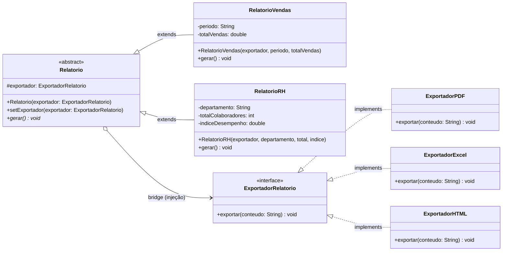
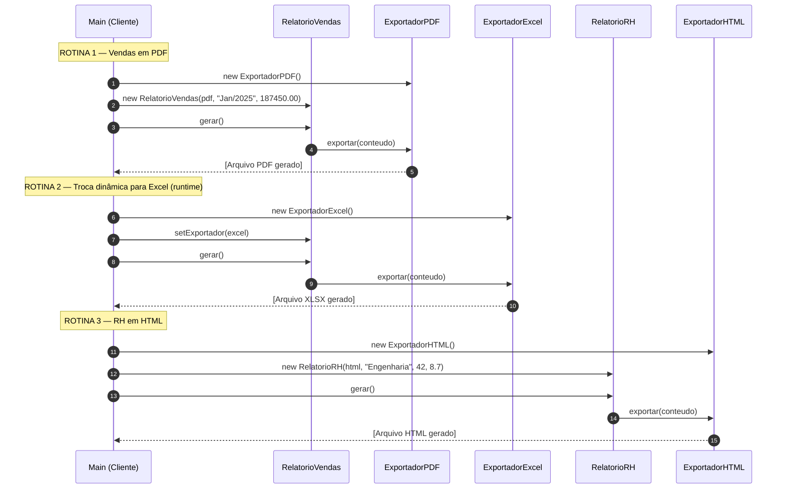

# TechFatec Business Intelligence — Módulo de Relatórios

> **Padrão de Projeto: Bridge** | Java | FATEC — Engenharia de Software

---

## Sumário

1. [Contexto e Problema](#1-contexto-e-problema)
2. [Solução: Padrão Bridge](#2-solução-padrão-bridge)
3. [Arquitetura de Diretórios](#3-arquitetura-de-diretórios)
4. [Diagrama de Classes (UML)](#4-diagrama-de-classes-uml)
5. [Diagrama de Sequência (UML)](#5-diagrama-de-sequência-uml)
6. [Componentes e Responsabilidades](#6-componentes-e-responsabilidades)
7. [Injeção de Dependência via Construtor](#7-injeção-de-dependência-via-construtor)
8. [Relação com SOLID / OCP](#8-relação-com-solid--ocp)
9. [Como Compilar e Executar](#9-como-compilar-e-executar)
10. [Saída Esperada](#10-saída-esperada)

---

## 1. Contexto e Problema

O sistema legado do **TechFatec BI** gerava exclusivamente o **Relatório de Vendas** em formato **PDF**.

O novo requisito exige:
- Inclusão do **Relatório de Desempenho de RH**.
- Suporte aos formatos **PDF**, **Excel (XLSX)** e **HTML** para **todos** os relatórios (atuais e futuros).

Sem um padrão arquitetural, a solução ingênua criaria uma subclasse por combinação:

| | PDF | XLSX | HTML |
|---|---|---|---|
| RelatorioVendas | RelatorioVendasPDF | RelatorioVendasExcel | RelatorioVendasHTML |
| RelatorioRH | RelatorioRHPDF | RelatorioRHExcel | RelatorioRHHTML |

**Resultado: explosão de subclasses** — `M tipos × N formatos` classes, todas com acoplamento rígido.

---

## 2. Solução: Padrão Bridge

O **Padrão Bridge** separa a hierarquia de **abstrações** (tipos de relatório) da hierarquia de **implementações** (formatos de exportação), permitindo que ambas variem de forma independente.

```
Abstrações (O QUÊ gerar)      Implementações (COMO exportar)
─────────────────────────     ─────────────────────────────
      Relatorio          ──── ExportadorRelatorio (interface)
         │                            │
  ┌──────┴──────┐            ┌────────┼────────┐
  │             │            │        │        │
RelatorioVendas RelatorioRH  PDF    Excel    HTML
```

**Com Bridge:** `M + N` classes no total (em vez de `M × N`).

---

## 3. Arquitetura de Diretórios

```
techfatec-bridge/
│
├── src/
│   ├── abstracao/
│   │   ├── Relatorio.java          ← Abstração base (abstract class)
│   │   ├── RelatorioVendas.java    ← Abstração Refinada
│   │   └── RelatorioRH.java        ← Abstração Refinada
│   │
│   ├── implementacao/
│   │   ├── ExportadorRelatorio.java ← Interface Implementor (contrato)
│   │   ├── ExportadorPDF.java       ← ConcreteImplementor
│   │   ├── ExportadorExcel.java     ← ConcreteImplementor
│   │   └── ExportadorHTML.java      ← ConcreteImplementor
│   │
│   └── cliente/
│       └── Main.java               ← Script de validação / Client
│
└── README.md
```

---

## 4. Diagrama de Classes (UML)



> **Linha tracejada (`<|..`)** = implementação de interface.  
> **Linha sólida (`<|--`)** = herança.  
> **Losango aberto (`o-->`)** = agregação — a "ponte" entre as hierarquias.

---

## 5. Diagrama de Sequência (UML)



---

## 6. Componentes e Responsabilidades

### Hierarquia de Abstração — `/src/abstracao/`

| Classe | Papel Bridge | Responsabilidade |
|---|---|---|
| `Relatorio` | **Abstraction** | Classe base abstrata; mantém a referência (ponte) ao `ExportadorRelatorio`; define `gerar()` como contrato |
| `RelatorioVendas` | **RefinedAbstraction** | Implementa `gerar()` com dados de vendas; delega a exportação ao implementador injetado |
| `RelatorioRH` | **RefinedAbstraction** | Implementa `gerar()` com dados de RH; delega a exportação ao implementador injetado |

### Hierarquia de Implementação — `/src/implementacao/`

| Classe | Papel Bridge | Responsabilidade |
|---|---|---|
| `ExportadorRelatorio` | **Implementor** | Interface que define o contrato `exportar(String conteudo)` |
| `ExportadorPDF` | **ConcreteImplementor** | Simula a geração de arquivo PDF |
| `ExportadorExcel` | **ConcreteImplementor** | Simula a geração de arquivo XLSX |
| `ExportadorHTML` | **ConcreteImplementor** | Simula a geração de arquivo HTML |

### Cliente — `/src/cliente/`

| Classe | Papel Bridge | Responsabilidade |
|---|---|---|
| `Main` | **Client** | Compõe abstrações e implementações; valida as 3 rotinas obrigatórias |

---

## 7. Injeção de Dependência via Construtor

A diretriz arquitetural **proíbe o uso do operador `new`** dentro das classes de relatório para instanciar exportadores.

**❌ Forma proibida (acoplamento rígido):**
```java
// Dentro de RelatorioVendas.gerar() — ERRADO
ExportadorPDF pdf = new ExportadorPDF(); // violação — alto acoplamento
pdf.exportar(conteudo);
```

**✅ Forma correta (injeção via construtor):**
```java
// Construtor de Relatorio (superclasse)
public Relatorio(ExportadorRelatorio exportador) {
    this.exportador = exportador; // recebe a dependência, não a cria
}

// No Cliente (Main.java) — local correto para o new
Relatorio r = new RelatorioVendas(new ExportadorPDF(), "Jan/2025", 187450.00);
```

O operador `new` para exportadores existe **exclusivamente no `Main.java`**, cumprindo o princípio de separação de criação e uso de objetos.

---

## 8. Relação com SOLID / OCP

O **Princípio Aberto/Fechado** afirma:  
> *"Entidades de software devem ser abertas para extensão, mas fechadas para modificação."*

Com o Padrão Bridge aplicado:

| Extensão necessária | Ação | Classes modificadas |
|---|---|---|
| Novo formato (ex: CSV) | Criar `ExportadorCSV implements ExportadorRelatorio` | **Zero** classes existentes alteradas |
| Novo tipo de relatório (ex: Financeiro) | Criar `RelatorioFinanceiro extends Relatorio` | **Zero** exportadores alterados |
| Combinar ambos | Injetar qualquer exportador no novo relatório | Só a classe `Main` (cliente) |

---

## 9. Como Compilar e Executar

**Pré-requisito:** Java JDK 8+

```bash
# 1. Compilar todos os pacotes para o diretório /out
cd src
javac -d ../out abstracao/*.java implementacao/*.java cliente/*.java

# 2. Executar a classe principal
java -cp out cliente.Main
```

---

## 10. Saída Esperada

```
==========================================================
  TechFatec Business Intelligence — Módulo de Relatórios
  Padrão Bridge | Injeção de Dependência via Construtor
==========================================================

>>> ROTINA 1: Relatório de Vendas em PDF

[Relatório de Vendas] Gerando conteúdo...
╔══════════════════════════════════════════╗
║         EXPORTANDO PARA PDF              ║
╠══════════════════════════════════════════╣
║  Formato : PDF (Portable Document Format)║
║  Conteúdo: Relatório de Vendas | Perío...║
║  Status  : Arquivo .pdf gerado com êxito ║
╚══════════════════════════════════════════╝

>>> ROTINA 2: Troca dinâmica — Relatório de Vendas agora em EXCEL

[Relatório de Vendas] Gerando conteúdo...
╔══════════════════════════════════════════╗
║         EXPORTANDO PARA EXCEL            ║
╠══════════════════════════════════════════╣
║  Formato : XLSX (Microsoft Excel)        ║
║  Conteúdo: Relatório de Vendas | Perío...║
║  Status  : Arquivo .xlsx gerado com êxito║
╚══════════════════════════════════════════╝

>>> ROTINA 3: Relatório de Desempenho de RH em HTML

[Relatório de RH] Gerando conteúdo...
╔══════════════════════════════════════════╗
║         EXPORTANDO PARA HTML             ║
╠══════════════════════════════════════════╣
║  Formato : HTML (HyperText Markup Lang.) ║
║  Conteúdo: Relatório de RH | Depto: En...║
║  Status  : Arquivo .html gerado com êxito║
╚══════════════════════════════════════════╝

==========================================================
  Todas as rotinas executadas com sucesso.
  Padrão Bridge validado: abstrações e implementações
  variam de forma independente (OCP/SOLID).
==========================================================
```

---

## Autoria

Projeto desenvolvido para a disciplina de **Padrões de Projeto** — FATEC.
Padrão implementado: **Bridge** (GoF — Gang of Four).

| # | Integrante |
|---|---|
| 1 | Ricardo |
| 2 | Guilherme |
